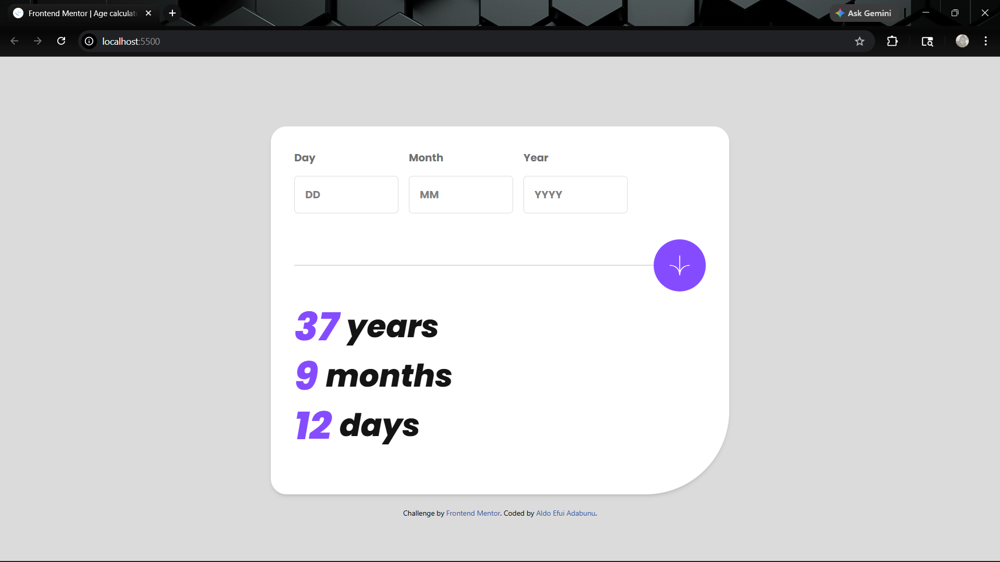

# Frontend Mentor - Age calculator app solution

A simple frontend age calculator application built with HTML, JavaScript, and Tailwind CSS.

This project was later containerized with Docker and automated with a CI/CD pipeline using GitHub Actions and Docker Hub.

---
## Table of contents

- [Overview](#overview)
  - [Features](#features)
  - [Tech Stack](#tech-stack)
  - [Docker Setup](#docker-setup)
- [CI/CD Workflow](#ci/cd-workflow)
  - [Screenshot](#screenshot)
  - [links](#links)
- [Author](#author)
- [Acknowledgments](#acknowledgments)

## Features

- Calculates age based on date of birth
- Frontend validation for user input
- Responsive UI
- Tailwind CSS styling
- Containerized with Docker
- Automated image build and push with GitHub Actions

## Tech Stack

- HTML
- JavaScript
- Tailwind CSS
- Docker
- Nginx
- GitHub Actions
- Docker Hub

## Docker Setup

This app uses a multi-stage Docker build:

1. A Node.js stage to install dependencies and build the Tailwind CSS output
2. An Nginx stage to serve the final static files

### CI/CD Workflow
This project includes a GitHub Actions workflow that automatically:
- Checks out the repository
- Logs into Docker Hub using secrets
- Builds the Docker image
- Pushes the image to Docker Hub
- Applies both: 
  - A `latest` tag for the most recent build
  - Commit specific tags for versioning

This makes every push to the repository automatically produce a deployable container image.

### Screenshot

### Links

- Solution URL: [Add solution URL here](https://github.com/KwakuAldo/age-calculator-app-main/tree/master/design)
- Live Site URL: [Add live site URL here](https://agecalcuapp.netlify.app/)

## My process

### Built with

- Semantic HTML5 markup
- Tailwind CSS - For styles
- Flexbox
- Mobile-first workflow
- JavaScript - For form validation and functionality

### What I learned

The purpose of the project is not only to build a functional age calculator, but also to practice real world DevOps concepts such as:
- Containerization with Docker
- CI/CD automation with GitHub Actions
- Image management with Docker Hub
- Docker Hub integration with GitHub for automated builds and deployments

### Continued development

Use this section to outline areas that you want to continue focusing on in future projects. These could be concepts you're still not completely comfortable with or techniques you found useful that you want to refine and perfect.

## Author

- Website - [Aldo Efui Adabunu](https://dotaldokwaku.netlify.app/)
- Frontend Mentor - [@KwakuAldo](https://www.frontendmentor.io/profile/KwakuAldo)
- Twitter - [@TheGrand_Rascal](https://www.twitter.com/TheGrand_Rascal)